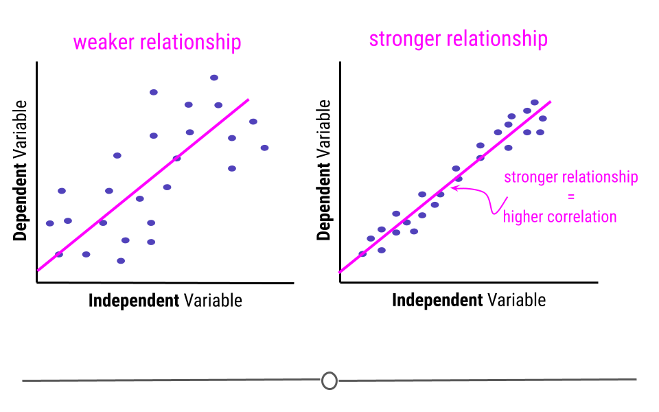
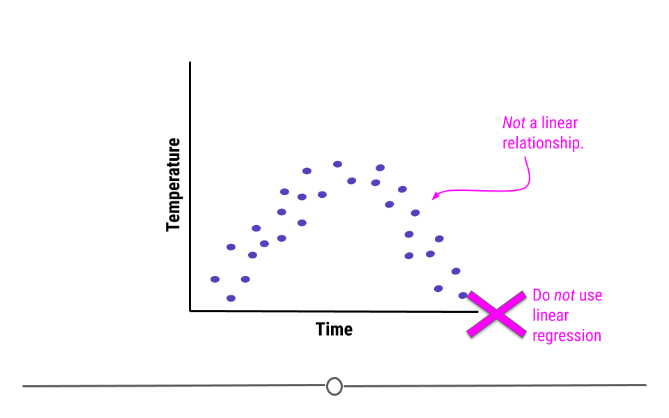
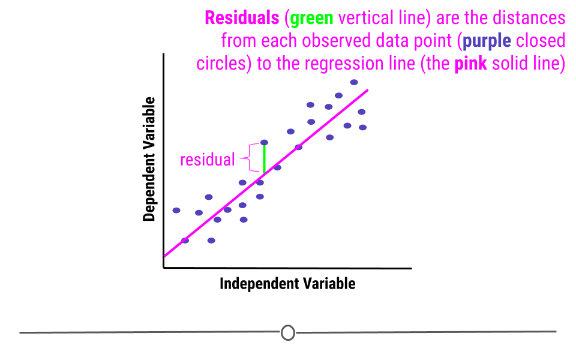

# Statistical testing

## Statistics ^[Wikipedia; Romijn, Jan-Willem (2014). "Philosophy of statistics". Stanford Encyclopedia of Philosophy.]

discipline that concerns the collection, organization, analysis, interpretation and presentation of data

## Statistic tools Family

<br/><br/>

```{mermaid}
%%| echo: false

graph TD
  A[Statistics] --> B[Descriptive]
  A --> C[Inferential]
  A --> D[Bayesian]
  A --> E[Statistical learning]
  
  B --> F[Central tendency]
  B --> G[Distribution]
  B --> H[Plot]

  C --> I[T-test]
  C --> J[ANOVA]

  E --> K[AI]
  E --> L[NN]
```

## Drug testing

- 2 new pain killer, test in 10 persons that have pain.
  - A: 8 of 10 get better.
  - B: 9 of 10 get better.

- 2 new pain killer, test in 100 persons that have pain.
  - A: 70 of 100 get better.
  - B: 79 of 100 get better.

## Statistical inference

<br/><br/>

::: {.r-hstack}
::: {style="backdrop-filter: blur(5px); box-shadow: 0 0 1rem 0 rgba(0, 0, 0, .5); background-color: #99BC85; color: white; border-radius: 20px; text-align: center; aspect-ratio: 1 / 1;width: 200px; margin: auto;font-size: 2vw; margin: auto;"}
Observe <br/> **Sample**
:::

::: {}
**------>**
:::


::: {style="backdrop-filter: blur(5px); box-shadow: 0 0 1rem 0 rgba(0, 0, 0, .5); background-color: #99BC85; color: white; border-radius: 20px; text-align: center; aspect-ratio: 1 / 1;width: 200px; margin: auto; font-size: 2vw"}
Infer <br/> **Population**
:::

:::

## Hypothesis testing: statistical inference

1. Convert the **research hypothesis to null hypothesis** and try to disprove. The decide which test & tails to be used.
2. decide on a **significance level** – the probability with which we are prepared to make a wrong decision if the null hypothesis is true.
3. Experimental design & do data collection
4. Perform **requirement check** then **Calculate p-value** 
5. **Compare p-value** with a significance level then end up either accepting or rejecting the null hypothesis.
6. Interpretation

## State the hypothesis

- Parameters
  - mean $(\mu)$
  - standard variation $(\sigma)$
  - distribution
- Alternative relationship
  - not equal $(\neq)$ - two tail
  - greater than $(\gt)$ - one tail
  - lower than $(\lt)$ - one tail

## Hypotheses

<br/>

| Null (not-sig: true) | Alternative (sig: true)|
|:------------|:------------|
| $\mu = 15$ | $\mu \neq 15$ |
| $\mu \leq 15$ | $\mu \gt 15$ |
| $\mu_1 = \mu_2$ | $\mu_1 \neq \mu_2$ |
| $\mu_1 \geq \mu_2$ | $\mu_1 \lt \mu_2$ |
| $\mu_1 = \mu_2 = \mu_3 ...$ | $\mu_1 \neq \mu_2, \mu_1 \neq \mu_3 ...$ |

## Choose the test: Parametric and non-parametric

:::: columns
::: {.column width="50%"}

**Parametric**

- test based on parameterized distributions
  - T-Test
  - ANOVA
- More strictness
- Requirement check
:::

::: {.column width="50%"}

**Non parametric**

- not based on parameterized distributions
  - Mann-Whitney
  - Kruskal-Wallis
- Less strictness
- No requirement
:::

::::

## Decide the significant level

<br/>
<br/>

|| null hypothesis is true | null hypothesis is false |
|----|-----------|------------|
| accept null hypothesis | Good | Type II ($\beta$) error  |
| reject null hypothesis | Type I ($\alpha$) error  | Good |

## Choosing the test

1. Choosing the test based on the hypothesis
1. Decide on the significant level & collect the data
1. Choose the parametric first
1. Checking the assumption of the test
1. Calculate p-value, confidence limit
1. Accept or reject null hypothesis

## P-Value

```{julia}
#| echo: false
using CairoMakie, Distributions

# Create data for normal distribution
x = range(-3, 3, length=100)
y = pdf.(Normal(), x)

# Observed data point
observed_point = 1.5

# P-value area
p_value_x = range(observed_point, 3, length=100)
p_value_y = pdf.(Normal(), p_value_x)

# Plotting
f = Figure()
ax = Axis(f[1, 1], 
    xlabel="Set of All Possible Results", 
    ylabel="Probability Density")

lines!(ax, x, y, linewidth=2)
vlines!(ax, [-2.5, 2.5], linestyle=:dash)

text!(ax, -2.5-0.4, 0.2, text="Very un-likely\nobservations", align=(:right, :center))
text!(ax, 2.5+0.4, 0.2, text="Very un-likely\nobservations", align=(:left, :center))
text!(ax, 0, maximum(y)+0.02, text="More likely observation", align=(:center, :bottom))

# Arrow
arrows!(ax, [observed_point - 0.4], [pdf(Normal(), observed_point) - 0.08], [0.35], [-0.04], color=:red)
text!(ax, observed_point - 0.75, pdf(Normal(), observed_point + 0.5), text="Observed\ndata point", color=:red, align=(:right, :center))

band!(ax, p_value_x, 0, p_value_y, color=(:green, 0.5))
text!(ax, observed_point + 0.25, 0.05, text="P-value")

hidedecorations!(ax, label=false, ticklabels=false, ticks=false)
f
```

## Wrong interpretation of P-Value

When the same hypothesis is tested in different studies; if P of Drug ‘A’ is smaller than drug ‘B’, then drug ‘A’ is more effective than drug ‘b’.

## choosing Statistic Testing

- **type of parameter**: mean, variance, distribution, proportion
- **number of sample group**: one, two, more
- **type of variable**: focus on continuous
- **number of independent variable**: focus on one
- **number of dependent variable**: focus on one
- **parametric vs non parametric**

## Testing of Mean 1 sample

| normal ? | extra requirement| test to use |
|---|--------|-------------|
| yes | N/A | one sample T-Test of mean|
| no | N/A | Mann-Whitney U |

## Testing of Mean 2 samples

| normal ? | extra requirement| test to use |
|---|--------|-------------|
| yes | sample pair| paired T-Test of mean |
| no | sample pair| Wilcoxon signed rank test |
| yes | equal variance | two sample T-Test of mean of equal variance |
| yes | nonequal variance | two sample T-Test of mean of non equal variance |
| no | N/A | Wilcoxon rank-sum test|

## Testing of Mean more samples

| normal ? | extra requirement| test to use |
|---|--------|--------------|
| yes | N/A | One-Way ANOVA |
| no  | N/A | Kruskal-Wallis test |

## Testing of Variance

- Bartlett Test of Homogeneity of Variances

## Testing of Distribution

- Shapiro-Wilk test of normality

## library installation

- tidyverse
  - tibble
  - tribble
  - readr
  - tidyr
  - dplyr
  - ...
- tidymodels
  - infer
  
```{julia}
#| eval: false
using Pkg
Pkg.add(["Tidier", "CSV", "DataFrames", "HypothesisTests", "GLM", "CairoMakie", "Distributions", "AnovaGLM"])
```

## calling library

```{julia}
#| code-fold: true
#| code-summary: "Show the code"

using Tidier, CSV, DataFrames, HypothesisTests, GLM, CairoMakie, Distributions, AnovaGLM
```

## The NHANES data

| Variable           | Definition                                                                                                                                                                               |
|:--------------------------------|:--------------------------------------|
| id                 | A unique sample identifier                                                                                                                                                               |
| Gender             | Gender (sex) of study participant coded as male or female                                                                                                                                |
| Age                | Age in years at screening of study participant. Note: Subjects 80 years or older were recorded as 80.                                                                                    |
| Race               | Reported race of study participant, including non-Hispanic Asian category: Mexican, Hispanic, White, Black, Asian, or Other. Not availale for 2009-10.                                   |
| Education          | Educational level of study participant Reported for participants aged 20 years or older. One of 8thGrade, 9-11thGrade, HighSchool, SomeCollege, or CollegeGrad.                          |
| MaritalStatus      | Marital status of study participant. Reported for participants aged 20 years or older. One of Married, Widowed, Divorced, Separated, NeverMarried, or LivePartner (living with partner). |
| RelationshipStatus | Simplification of MaritalStatus, coded as Committed if MaritalStatus is Married or LivePartner, and Single otherwise.                                                                    |
| Insured            | Indicates whether the individual is covered by health insurance.                                                                                                                         |
| Income             | Numerical version of HHIncome derived from the middle income in each category                                                                                                            |
| Poverty            | A ratio of family income to poverty guidelines. Smaller numbers indicate more poverty                                                                                                    |
| HomeRooms          | How many rooms are in home of study participant (counting kitchen but not bathroom). 13 rooms = 13 or more rooms.                                                                        |
| HomeOwn            | One of Home, Rent, or Other indicating whether the home of study participant or someone in their family is owned, rented or occupied by some other arrangement.                          |
| Work               | Indicates whether the individual is current working or not.                                                                                                                              |
| Weight             | Weight in kg                                                                                                                                                                             |
| Height             | Standing height in cm. Reported for participants aged 2 years or older.                                                                                                                  |
| BMI                | Body mass index (weight/height2 in kg/m2). Reported for participants aged 2 years or older.                                                                                              |
| Pulse              | 60 second pulse rate                                                                                                                                                                     |
| BPSys              | Combined systolic blood pressure reading, following the procedure outlined for BPXSAR.                                                                                                   |
| BPDia              | Combined diastolic blood pressure reading, following the procedure outlined for BPXDAR.                                                                                                  |
| Testosterone       | Testerone total (ng/dL). Reported for participants aged 6 years or older. Not available for 2009-2010.                                                                                   |
| HDLChol            | Direct HDL cholesterol in mmol/L. Reported for participants aged 6 years or older.                                                                                                       |
| TotChol            | Total HDL cholesterol in mmol/L. Reported for participants aged 6 years or older.                                                                                                        |
| Diabetes           | Study participant told by a doctor or health professional that they have diabetes. Reported for participants aged 1 year or older as Yes or No.                                          |
| DiabetesAge        | Age of study participant when first told they had diabetes. Reported for participants aged 1 year or older.                                                                              |
| nPregnancies       | How many times participant has been pregnant. Reported for female participants aged 20 years or older.                                                                                   |
| nBabies            | How many of participants deliveries resulted in live births. Reported for female participants aged 20 years or older.                                                                    |
| SleepHrsNight      | Self-reported number of hours study participant usually gets at night on weekdays or workdays. Reported for participants aged 16 years and older.                                        |
| PhysActive         | Participant does moderate or vigorous-intensity sports, fitness or recreational activities (Yes or No). Reported for participants 12 years or older.                                     |
| PhysActiveDays     | Number of days in a typical week that participant does moderate or vigorous-intensity activity. Reported for participants 12 years or older.                                             |
| AlcoholDay         | Average number of drinks consumed on days that participant drank alcoholic beverages. Reported for participants aged 18 years or older.                                                  |
| AlcoholYear        | Estimated number of days over the past year that participant drank alcoholic beverages. Reported for participants aged 18 years or older.                                                |
| SmokingStatus      | Smoking status: Current Former or Never.                                                                                                                                                 |


## import data to tibbles

```{julia}
nh = CSV.read("nhanes.csv", DataFrame)
nh
```

## view tibbles

```{julia}
#| eval: false
# In Julia, you can just type 'nh' or use a viewer in VS Code
nh
```

## normality test: Shapiro-Wilk test of normality

$$ H_0 : data distribution = normal distribution $$
$$ H_1 : data distribution \neq normal distribution $$

```{julia}
bmi_yes = @chain nh begin
    @filter(Diabetes == "Yes")
    @pull(BMI)
    filter(!isnan, _)
end
ShapiroWilkTest(bmi_yes)
```

## Bartlett Test of Homogeneity of Variances

$$ H_0 : Var_{diabetes} = Var_{nondiabetes} $$
$$ H_1 : Var_{diabetes} \neq Var_{nondiabetes} $$

```{julia}
# HypothesisTests.jl uses LeveneTest for homogeneity of variances
bmi_groups = @chain nh begin
    @filter(Age >= 18 && !ismissing(Diabetes))
    @group_by(Diabetes)
    @summarize(bmis = [filter(!isnan, BMI)])
    @pull(bmis)
end
LeveneTest(bmi_groups...)
```

## t-test for a population mean (variance unknown)

- Object
  - To investigate the significance of the difference between an assumed population mean μ0 and a sample mean x ̄.

- Limitations
  1. If the variance of the population σ 2 is known, a more powerful test is available: the Z-test for a population mean (Test 1).
  2. The test is accurate if the population is normally distributed. If the population is not normal, the test will give an approximate guide.

- Example: Most of diabetic patient are overweight


## one sample T Test

$$ H_0 : \mu_{BMI_{diabetic}} = 25 $$ 
$$ H_1 : \mu_{BMI_{diabetic}} \neq 25 $$

```{julia}
bmi_adults = @chain nh begin
    @filter(Age >= 18)
    @pull(BMI)
    filter(!isnan, _)
end
OneSampleTTest(bmi_adults, 25)
```

## one sample T Test: inferiority test

$$ H_0 : \mu_{BMI_{diabetic}} \geq 25 $$ 
$$ H_1 : \mu_{BMI_{diabetic}} < 25 $$

```{julia}
test = OneSampleTTest(bmi_adults, 25)
pvalue(test, tail=:left)
```

## one sample T Test: superiority test

$$ H_0 : \mu_{BMI_{diabetic}} \leq 25 $$ 
$$ H_1 : \mu_{BMI_{diabetic}} > 25 $$

```{julia}
test = OneSampleTTest(bmi_adults, 25)
pvalue(test, tail=:right)
```

## t-test for two population means (variances unknown but equal)

- Object
  - To investigate the significance of the difference between the means of two populations.
- Limitations
  1. If the variance of the populations is known, a more powerful test is available: the Z-test for two population means (Test 2).
  2. The test is accurate if the populations are normally distributed. If the populations are not normal, the test will give an approximate guide.


## two sample T Test: equal variance, two-tail

$$ H_0 : \mu_{BMI_{diabetic}} = \mu_{BMI_{nondiabetic}} $$
$$ H_1 : \mu_{BMI_{diabetic}} \neq \mu_{BMI_{nondiabetic}} $$

```{julia}
group_yes = @chain nh begin @filter(Age >= 18 && Diabetes == "Yes") @pull(BMI) filter(!isnan, _) end
group_no = @chain nh begin @filter(Age >= 18 && Diabetes == "No") @pull(BMI) filter(!isnan, _) end
EqualVarianceTTest(group_yes, group_no)
```

## t-test for two population means (variances unknown and unequal)

- Object
  - To investigate the significance of the difference between the means of two populations.
- Limitations
  1. If the variances of the populations are known, a more powerful test is available: the Z-test for two population means (Test 3).
  2. The test is approximate if the populations are normally distributed or if the sample sizes are sufficiently large.
  3. The test should only be used to test the hypothesis μ1 = μ2.


## two sample T Test: not equal variance, two-tail

$$ H_0 : \mu_{BMI_{diabetic}} = \mu_{BMI_{nondiabetic}} $$
$$ H_1 : \mu_{BMI_{diabetic}} \neq \mu_{BMI_{nondiabetic}} $$

```{julia}
UnequalVarianceTTest(group_yes, group_no)
```

## two sample T Test: not equal variance, one-tail

$$ H_0 : \mu_{BMI_{diabetic}} \leq \mu_{BMI_{nondiabetic}} $$
$$ H_1 : \mu_{BMI_{diabetic}} > \mu_{BMI_{nondiabetic}} $$

```{julia}
test = UnequalVarianceTTest(group_yes, group_no)
pvalue(test, tail=:right)
```

## Wilcoxon rank-sum test (a.k.a. Mann-Whitney U test)

```{julia}
MannWhitneyUTest(group_yes, group_no)
```

# ANOVA

## comparing BMI among Race

```{julia}
unique(nh.Race)
```

## preparing data

```{julia}
nhaov = @chain nh begin
    @filter(Race != "Other" && !ismissing(Diabetes) && !isnan(BMI))
    @mutate(
        Race = factor(Race),
        Diabetes = factor(Diabetes)
    )
end
nhaov
```

## box plot

```{julia}
@ggplot(nhaov, aes(x = Race, y = BMI, color = Race)) +
    @geom_boxplot() +
    @facet_grid(cols = Diabetes)
```

## summarize by group

```{julia}
@chain nhaov begin
    @group_by(Race, Diabetes)
    @summarize(mean = mean(BMI))
    @ungroup()
end
```

## Analysis of Varience

$$ H_0 : \mu_{BMI_{Asian}} = \mu_{BMI_{Black}} = \mu_{BMI_{White}} = \mu_{BMI_{Mexican}} = \mu_{BMI_{Hispanic}} $$

```{julia}
model = lm(@formula(BMI ~ Race), nhaov)
AnovaGLM.anova(model)
```

## Post-hoc

```{julia}
# For post-hoc tests in Julia, MultipleTesting.jl is commonly used.
# Tukey HSD can be performed via pairwise comparisons with p-value adjustments.
println("Post-hoc analysis via pairwise comparisons")
```

# simple linear regression

## Model

$$ BMI = \beta_0 + \beta_1 Age $$
{fig-align="center"}

## Assumptions

- Non-linearity
- Heteroscedasticity
- Outlier values
- Normality of residuals

## Non-linearity

{fig-align="center"}

## Heteroscedasticity

{fig-align="center"}

## Normality of residuals

{fig-align="center"}
{fig-align="center"}

## plot

```{julia}
@ggplot(nh, aes(x = BMI, y = Age)) + 
    @geom_point() + 
    @geom_smooth(method = "lm")
```

## Fitting

```{julia}
model_reg = lm(@formula(BMI ~ Age), nh)
model_reg
```

## Model Diagnostics

```{julia}
# Model diagnostics can be visualized by plotting residuals
res = residuals(model_reg)
fitted = predict(model_reg)

f = Figure()
ax1 = Axis(f[1, 1], title="Residuals vs Fitted", xlabel="Fitted values", ylabel="Residuals")
scatter!(ax1, fitted, res)
hlines!(ax1, 0, linestyle=:dash, color=:red)
f
```

## References

-   https://sparkbyexamples.com/r-programming/select-rows-in-r/
-   https://4va.github.io/biodatasci/
-   https://bioconnector.github.io/